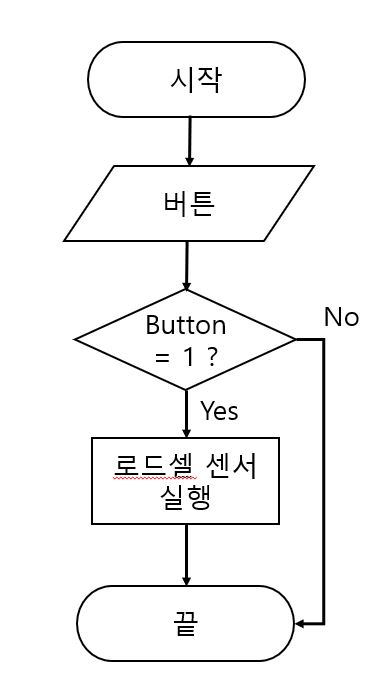
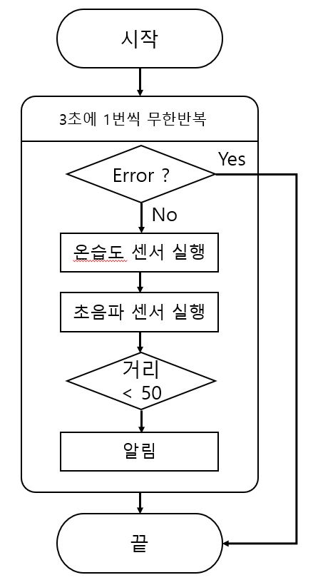

# Graduation-PJ
하드웨어
=========================
  하드웨어적 요소만 우선 고려 . 업데이트 예정 v1(2023.03.03)

-------------------------

# 물통

## 필요 센서    
> 1. 버튼    
>	2. 로드셀   
> 3. 초음파

## 주요 기능      
>  - 버튼을 누르면 로드셀 센서가 무게 측정
>	 - 텀블러 변경 시 기존 무게 초기화 및 재측정    
>	 - 무게 및 물의 량 등 파일에 기록
>	 - 초음파 센서로 물통의 유무 파악 

## 순서도 

- 물통   

-------------------
- 약통
 
